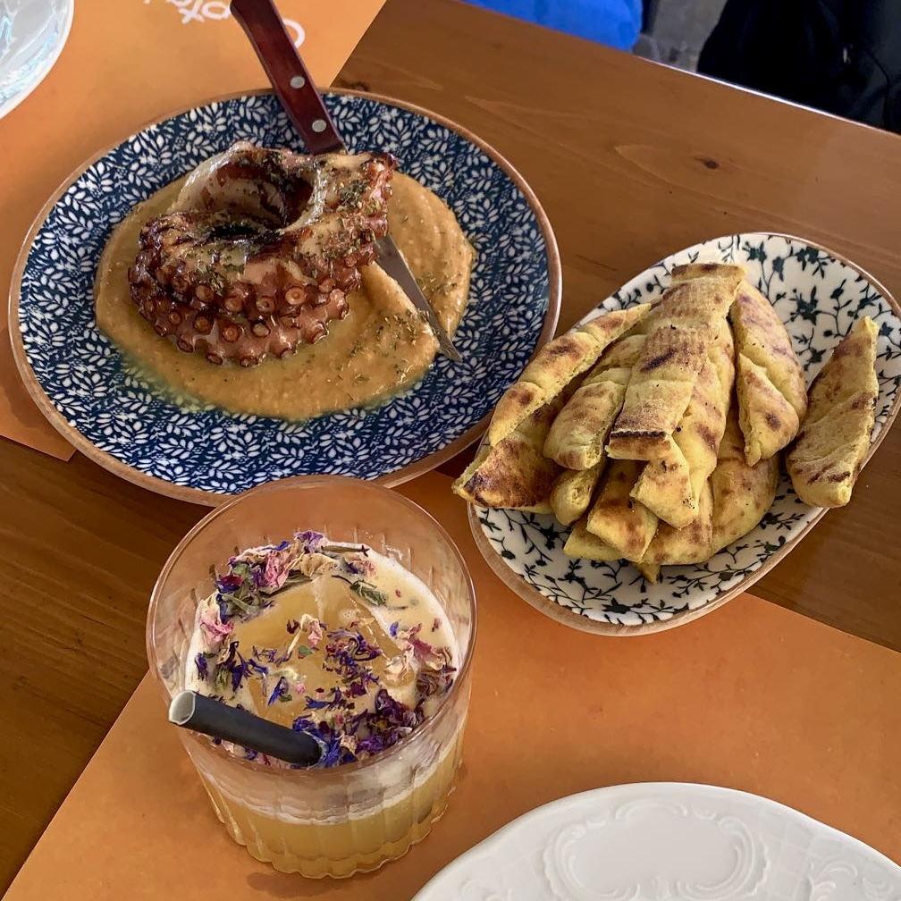
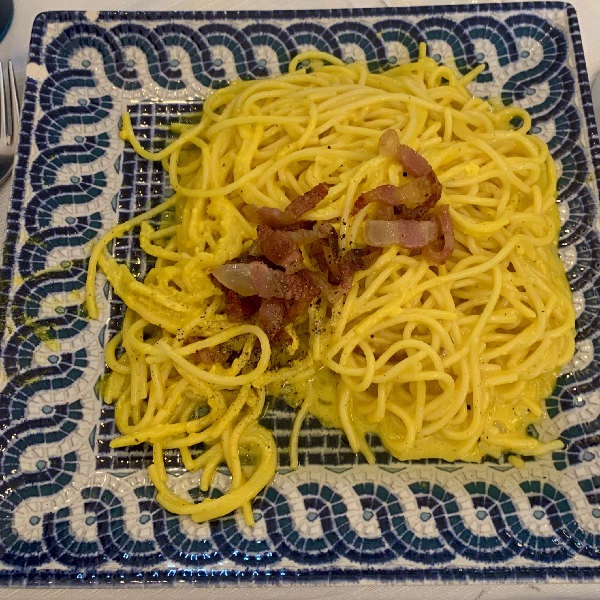
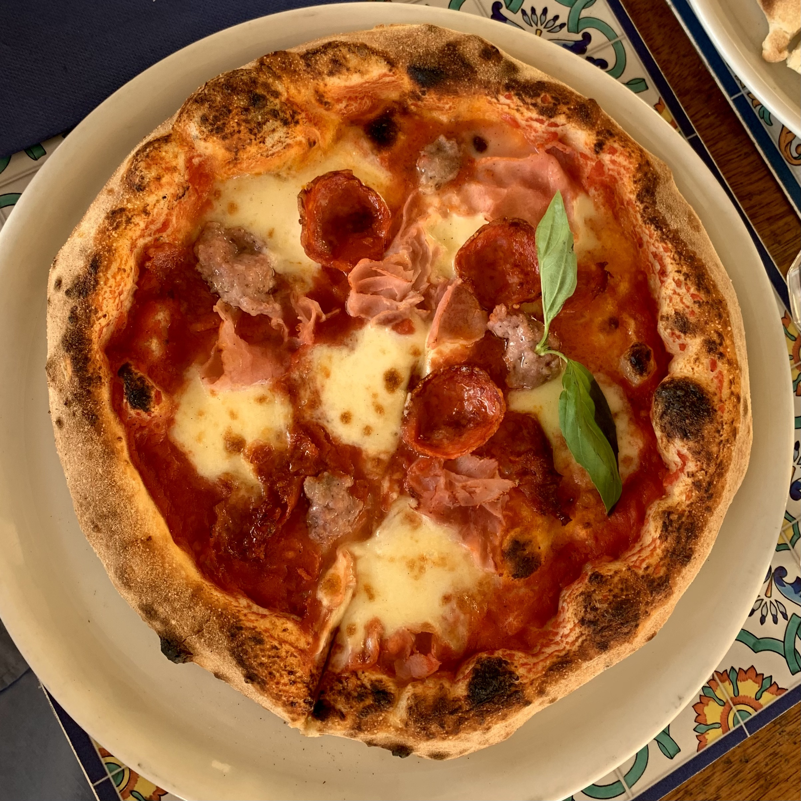
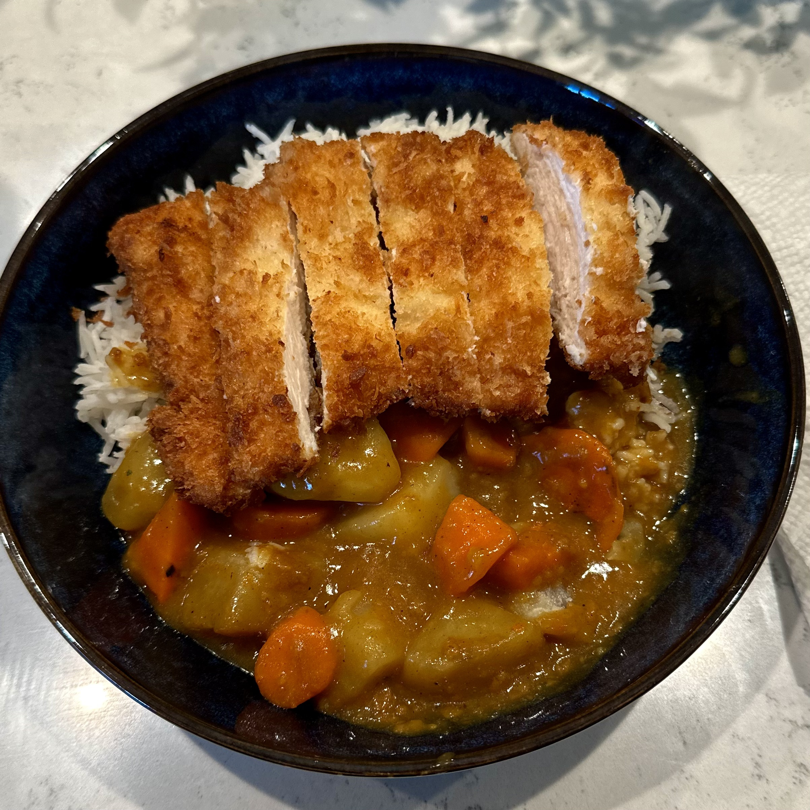
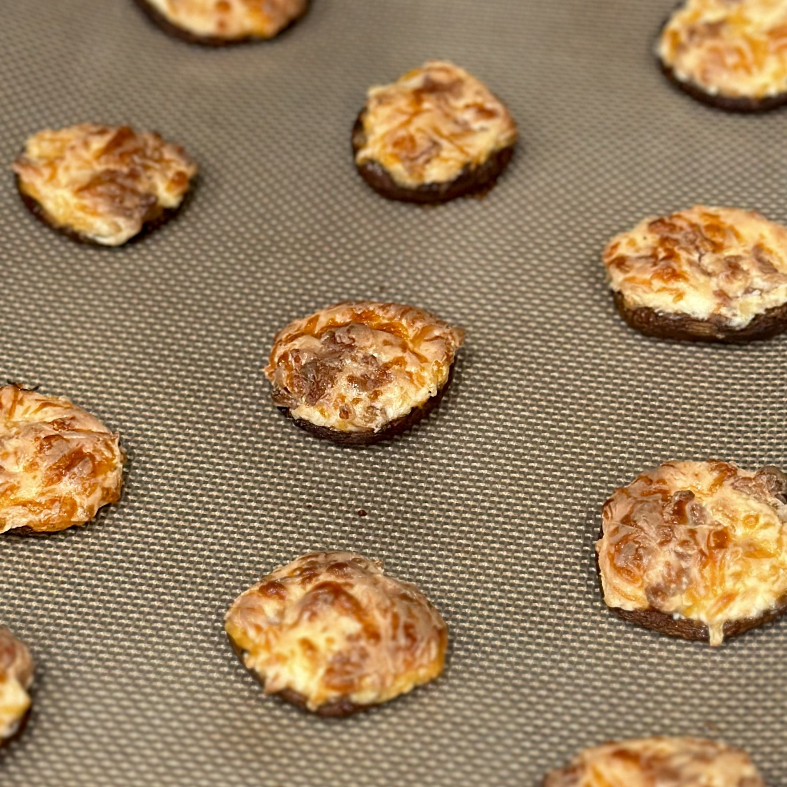

# Gastronomic

*Gastronomic* is an adjective relating to the term *gastronomy*: the art, science, and study of preparing, cooking, and eating food. In line with its name, this website is a collection of articles exploring food, cooking, ingredients, and culinary traditions from around the world. These articles range from individual dishes and ingredients to broader techniques and cuisines, combining background information with recipes, practical uses, and other resources for learning more. The site is designed as an interconnected network of food and cooking, where connections make it easy to move between topics and explore food without necessarily knowing what you are looking for when you begin.

  
  
  

## Why I Made Gastronomic

I have always enjoyed cooking, but much of my interest in food comes from everything there is to learn beyond simply following a recipe. Trying a new dish often leaves me with more questions than I had when I started. I might become interested in an unfamiliar ingredient, wonder where a particular technique came from, or discover another dish that I want to try next. Before long, learning about one food has led me somewhere completely different. 

I created Gastronomic as a way to document and organize that process of exploration. Instead of focusing on a single cuisine or type of food, I wanted the site to reflect the way my own interests develop. Some articles began with dishes I wanted to cook, while others grew out of ingredients, techniques, or ideas that I encountered along the way. This has allowed the scope of the site to develop naturally as I continue cooking and discovering new things. 

Building Gastronomic has also given me an opportunity to bring together several things I enjoy. Cooking gives me something to experiment with, research gives me a better understanding of what I am making, and web development provides a way to organize everything into something that other people can explore. As the site continues to grow, I hope it can serve both as a record of what I have learned and as a starting point for anyone else who is curious about food. 

  
  

## My Design Approach

Gastronomic combines research with my own experiences cooking and learning about food. When putting together an article, I try to understand not only how something is made, but also where it comes from, how it is traditionally used, and what makes it distinct. I use a variety of sources to research these topics, which are listed in the references section of each article for anyone interested in learning more. Additionally, I have included references toward the bottom of this page relating to web design and development for those looking to expand their horizons a bit further. 

The recipes and photographs throughout the site come from my own time in the kitchen. I try recipes myself, make adjustments as I learn, and document the process along the way. My goal is not to present any one recipe or method as definitive, but to share what I have learned while providing enough context for others to experiment, explore, and learn for themselves.

## References

- Beaird, Jason. *The Principles of Beautiful Web Design*. SitePoint, 2007. 
- Kubelka, Filip. “The Perfect Search Bar Design: UI/UX Best Practices.” *Luigi's Box*, 13 Aug. 2026, [luigisbox.com/blog/search-bar-design](https://www.luigisbox.com/blog/search-bar-design). Accessed 17 Aug. 2026. 
- Podmajersky, Torrey. *Strategic Writing for UX: Drive Engagement, Conversion, and Retention with Every Word*. O'Reilly Media, 2019. 